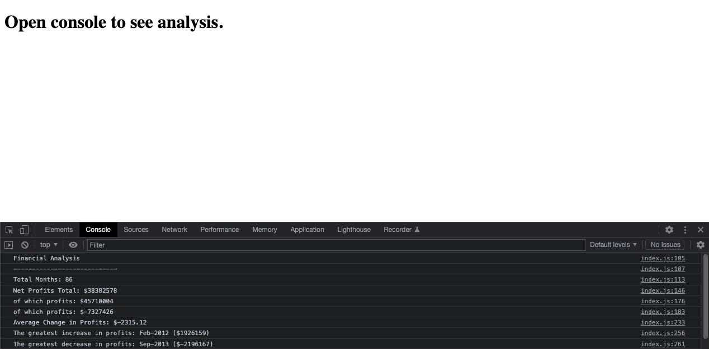

# console-finances

## Description 

This project aims to consolidate and demonstrate the JavaScript concepts I have learned so far, by writing code to analyse a dataset of financial records.

The code distills the dataset then outputs the analysis into the console for viewing.

The code has been written with consideration given to future usage. This means it could be used to analyse new data, provided the new data is presented in the same format.

During the process of writing this code I have increased my knowledge of JS arrays and methods including .slice which I found particularly useful for this task, as it creates a modified copy of an array rather than mutating the original array like .pop and .shift.

One issue I came up against was using .filter() so I used a work around with a loop and .push to achieve the desired separation.

## Link to deployed site

Please check out my first deployed [JavaScript project](https://stuart540.github.io/console-finances/)

## Usage 

This page is intended to run my JavaScript which analyses the financial data and outputs the results to the console:

## Credits

Many thanks to Jonas Schmedtmann and his [JavaScript course on Udemy](https://www.udemy.com/course/the-complete-javascript-course/) which I have used to help consolidate my knowledge and learn new methods for JavaScript.

## License

This project is licensed under the standard MIT license

